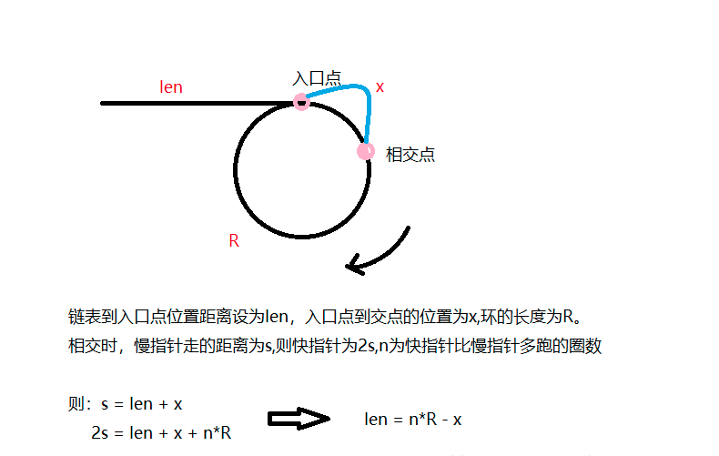

# 数据结构与算法

> 数据结构和算法是一个程序员的基础技能，现在我们就从头梳理一下相关的数据结构与算法的知识。

## 目录

1. [数组](#数组)
2. [链表](#链表)
3. [栈](#栈)
4. [队列](#队列)
5. [排序](#排序)
6. [二分查找](#二分查找)
7. [散列表](#散列表)
8. [哈希算法](#哈希算法)
9. [树](#树)
   1. [二叉树](#二叉树)
   2. [二叉搜索树](#二叉搜索树)

## 数组

数组是一种非常基础的数据结构，基本上每一种编程语言都会有数组类型。

数组是一种线性表（数据的关系只有前后关系），它使用一组连续的内存来存储数据，正由于这个特性，它才拥有随机访问的特性，但是也是由于这个特点，数组的插入和删除就需要做大量的数据搬移工作。

数组具有随机访问的特性，它的时间复杂度为 O(1)，那么为什么我们要说它删除和插入很低效呢？上面我们说过，数组使用的是一组连续的内存，那我们删除元素过后，要保持数组的特性，就需要将删除元素之后的元素往前搬，同理，在数组中插入一个元素也需要将元素进行搬移。

一种特殊的情况下，我们删除元素的时候，不去真正的删除，而是进行标记，当数组没有更多空间进行存储的时候再将标记已删除的元素进行删除（这是 JVM 的标记清除垃圾回收的思想）。

## 链表

链表相对于数组来说是一种比较复杂的数据结构，同时，它也是一种线性表结构，那么它和数组有什么区别呢？通过上面的学习我们知道，数组在内存中需要一段连续的内存空间，而链表不同，链表正好相反，它通过指针来串联不同的内存块，每个它不需要连续的内存空间，下面我们就会看到几种常见的链表结构。

1. 单向链表：顾名思义，每一个链表的结点除了存储数据之外，还存储了下一个结点的地址，通常我们将这个指针叫做后继指针 __next__，但链表的最后一个结点存的下一个地址是空值。
2. 循环链表：基本的信息和单向链表一样，但是不同的是最后一个结点存放的地址是头结点的地址。
3. 双向链表：刚我们说的单向链表有一个 __next__，而双向链表不同的是它拥有一个 __prev__ 前驱指针，也就是存放了链表的上一个结点的地址信息。

双向链表在插入、插入按值查询的效率也要比单向链表有优势，唯一的不足时需要使用更大的空间，这也使用空间换时间的一种做法。

### 问题 - 如何基于链表实现 LRU 缓存淘汰算法

首先，我们要清楚 LRU 缓存淘汰算法是什么？有几种常见的缓存算法，FIFO 先进先出算法，LFU 算法（也就是最少使用策略），LRU 算法（最近最少使用策略），那么我们如何通过链表来实现 LRU 呢？

我们先维护一个有序列表，越靠近尾部的结点是越早之前访问的，当一个新的数据被访问的时候就从头开始顺序遍历链表，假如这个数据在链表中，我们删除这个结点，然后把他插入到链表的头部，如果没有在链表中，我们就要看链表是否已经满了，如果没满，直接插入到头部，如果满了就删除尾结点，再添加头结点。

### 问题 - 如何判断一个单链表字符串是否是回文字符串

这个问题可使用经典的快慢指针：

```js
/**
 * 1. 有两个指针，一个快指针，一个慢指针
 * 2. 快指针一次走 2 步，慢指针一次走 1 步
 * 3. 这样当快指针结束的时候，慢指针的位置就是链表的中间结点，这时候将后面的链进行反转
 * 4. 然后针对反转过后的链表和前面的链表进行比对就知道是不是回文字符串的了
 */
class SingleLink {
  constructor(linkData) {
    this.link = null;
    if (Array.isArray(linkData)) {
      linkData.forEach(link => this.insertNodeToHead(link));
    }
  }

  insertNodeToHead(data) {
    if (this.link === null) {
      return this.link = {
        value: data,
        next: null,
      };
    }
    const newNode = {
      value: data,
      next: this.link,
    };
    this.link = newNode;
  }

  isPalindrome() {
    if (!this.link || !this.link.next) {
      return true;
    }
    let slow = this.link;
    let fast = this.link;

    while(fast && fast.next) {
      slow = slow.next;
      fast = fast.next.next;
    }

    slow = this.reverseList(slow);

    let head = this.link;
    while(slow) {
      if (head.value !== slow.value) {
        return false;
      }
      slow = slow.next;
      head = head.next;
    }

    return true;
  }

  reverseList(node) {
    let newNode = null;
    while(node) {
      let p = node;
      node = node.next;
      p.next = newNode;
      newNode = p;
    }
    return newNode;
  }
}
```

### 问题 - 反转单链表

```js
function reverseLink(root) {
    let newNode = null;
    while(root) {
        let p = root;
        root = root.next;
        p.next = newNode;
        newNode = p;
    }
    return newNode;
}
```

### 问题 - 链表中环的检测

```js
// 同样利用快慢指针，如果有环，快指针一定会追上慢指针
function checkCircle(root) {
    let slow = root;
    let fast = root;
    while(fast && fast.next) {
        slow = slow.next;
        fast = fast.next.next;
        if (fast.value === slow.value) {
            return true;
        }
    }
    return false;
}
```

### 问题 - 怎么知道入环点



也就是说，当两个指针相遇的时候，设置一个指针到头结点，然后两个指针同时走，一个指针走了 len，另一个走了 n 圈减 x，也就是入环点。

### 问题 - 如何知道两个链表交叉点

先要知道两个链表的长度 L1 / L2，然后长的那个先走 L1 - L2 的长度，然后同时走，相等的时候就是交叉点。

## 栈

栈是一种受限制的线性表数据结构，后进先出，先进后出，只允许在一端进行操作，既入栈、出栈。

同时栈也有数组实现的顺序栈，以及链表实现的链式栈。

## 队列

队列和栈一样，也是一种抽象数据结构，它的特点是先进先出。

## 排序


## 树

树是一种非线性表结构，树也是数据结构中非常重要且常用的结构之一，关于一些概念性的问题可以自己去了解一下[百度百科](https://baike.baidu.com/item/%E6%A0%91/2699484?fr=aladdin)。

树的结构是多样化的，接下来我们就学习一下常用的一些树结构。

### 二叉树

二叉树，顾名思义，每个节点最多有两个叉，也就是说最多两个子节点，但是并不要求每个节点都有两个子节点，可以只有左子节点，或者是右子节点等等。

那么有几种特殊情况是什么呢？

1. 满二叉树：这种情况是叶子节点全在最底层，除了叶子节点，每个节点都拥有左右两个子节点。
2. 完全二叉树：除了最后一层，每一层的节点都要达到最大，并且最后一层的叶子节点都要靠左。

下面我们要提出一个问题了，我们怎么存储树这种结构呢？

大家可能想到了，这种链式结构我们用链表就能够实现，大多数树结构也是这么存储的。

那么我们能够通过数组来对二叉树进行存储么？当然能了，比如说，我们将根节点存在索引为 `i = 1` 的位置，那么左节点存在 `2 * i = 2` 的位置，右子节点存在 `2 * i + 1 = 3` 的位置，以此类推就能够存储下二叉树了，但是不知道大家注意到没有，如果我们的二叉树不是上面定义的完全二叉树的形式，那么我们存储的数组就变成了一个稀疏数组。所以说，如果一棵树是完全二叉树，那么数组毫无疑问就是最节省内存的一种方式了。

#### 二叉树的遍历

1. 前序遍历：对于前序遍历而言，是遍历当前节点，再遍历左子树，最后遍历右子树。
2. 中序遍历：对于中序遍历而言，是遍历左子树，再遍历本身，再遍历右子树。
3. 后序遍历：对于后序遍历来说，是先遍历左子树，然后再遍历右子树，最后遍历本身。

那么对于这三种遍历方式如何书写代码呢？

```js
// 前序遍历
preOrder(tree) = print(tree.node) -> preOrder(tree.left) -> preOrder(tree.right)

function preOrder(tree) {
  if (tree === null) return;
  console.log(tree.node);
  preOrder(tree.left);
  preOrder(tree.right);
}
// 中序遍历
midOrder(tree) = midOrder(tree.left) -> print(tree.node) -> midOrder(tree.right)

function midOrder(tree) {
  if (tree === null) return;
  midOrder(tree.left);
  console.log(tree.node);
  midOrder(tree.right);
}
// 后序遍历
afterOrder(tree) = afterOrder(tree.left) -> afterOrder(tree.right) -> print(tree.node)

function afterOrder(tree) {
  if (tree === null) return;
  afterOrder(tree.left);
  afterOrder(tree.right);
  console.log(tree.node);
}
```

当然了，其实还有一种遍历方法，也就是按层遍历，这种遍历需要借助队列来进行实现。

```js
// 层遍历
function levelOrder(tree) {
  if (tree === null) return;

  const queue = [];
  queue.push(tree);
  while(queue.length !== 0) {
    const node = queue.shift();
    console.log(node.value);
    if (node.left) queue.push(node.left);
    if (node.right) queue.push(node.right);
  }
}
```

## 二叉搜索树


## 红黑树

