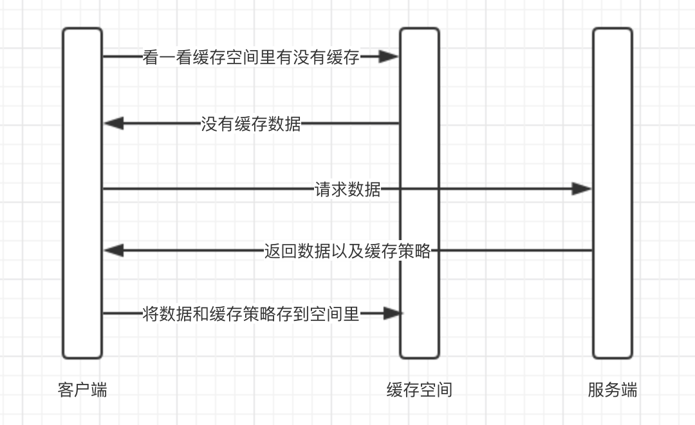

# Http 缓存那些事

> 说起浏览器缓存，可能大家都不陌生，但是具体是个什么情况可能有些同学就不知道了，下面就来说一说浏览器缓存的那些事。

浏览器拥有一个缓存空间，专门用来做浏览器缓存数据的存储。

那么我们在有这个存储空间的时候，浏览器是如何运作的呢？

当客户端去请求数据的时候，先去缓存空间找找有没有缓存，没有就去请求服务器数据，然后根据服务器返回的缓存策略，将数据和缓存策略存到缓存空间里。

我们可以看到，上面的关键就在于缓存策略，那么缓存策略都有哪些呢？下面我们就来一起看一看。

## 缓存策略

浏览器对静态资源的缓存本质上就是 HTTP 协议的缓存策略，而对于 HTTP 缓存策略来说，又分成强制缓存和协商缓存两类。而决定使用哪种策略是由 HTTP 协议的头部信息决定的。

### 强制缓存

强制缓存的关键就在于强制两个字，我给你一个过期时间，在到这个时间点之前都别来问我，你就用缓存就行了，就是这么霸道。

#### Expires 和 Cache-control

Expires 是 HTTP 1.0 加入的特性，它指定一个明确的时间点作为缓存资源的过期时间，优点是在过期时间之前减少 HTTP 请求，但是 Expires 有一个很严重的缺点，就是它指定的时间是以服务器为准，判断资源过期与否是依照本地时间进行对比。

为了解决这个问题，在 HTTP 1.1 新增了 Cache-control 头信息，常用的信息有下面这些：

- private、public：public 和 private 都表示此响应可以被浏览器缓存，而这两者之间的区别则是 private 表示不允许中间服务器对此响应进行缓存，public 则可以，默认值为 private。
- no-cache 、no-store：no-cache 不是不要缓存的意思，而是要先去和服务器确认资源是否发生变化，如果资源没有发生变化，就使用缓存而不去下载。相反的，no-store 才是真正的禁止缓存。
- max-age：这是使用的最频繁的一个了，它表示了从请求开始的时候计算，这个缓存有效的时间是多少秒。并且和 Expires 相比，max-age 的优先级更高。

### 协商缓存

协商缓存就是客户端需要去服务器确认缓存资源是否可用。

#### Etag 和 If-None-Match

Etag 是服务器为资源分配的唯一标识，作为响应头返回给客户端。当 Cache-control 为 no-cache 或者是 max-age、Expires 都过期的时候，就会通过 If-None-Match 把 Etag 发送给服务器，如果请求的资源 Etag 值没有变化就返回 304，告诉浏览器资源没有变化。

如果想强制使用协商缓存，就将 Cache-control 设置为 no-cache 就行了。

#### Last-Modified 和 If-Modified_Since

这个和上面那个差不多，就是在相应时，带上了文件更改时间，在下一次请求的时候会将文件更改时间带上，发送给服务器。

### 用户行为对缓存的影响

关于 http 缓存就说这么多。
